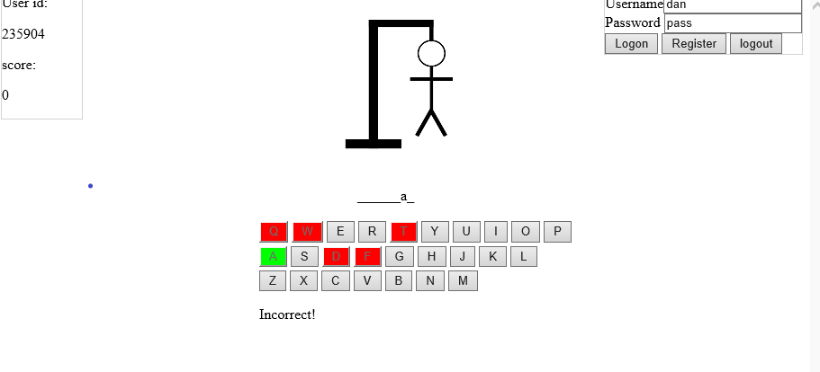

# HangmanGame
A simple hangman game i made using javascript and C# for asp.net.

To run the game you must first unzip the words, once you have unzipped the words.zip you place it in the folder hangman and then you can run it using Visual studio(Thats what i used) as a website.
 
